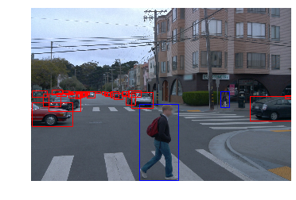
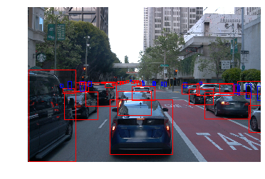
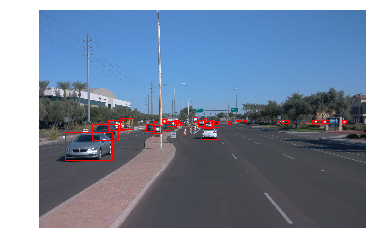
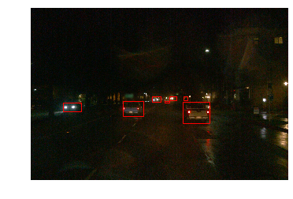
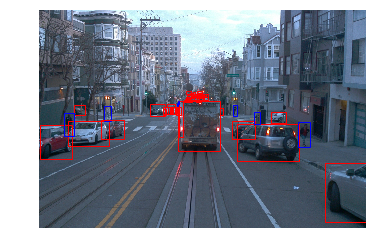

# Object detection in an Urban Environment

This is a repository containing the details of the Computer Vision starter module for Udacity Self Driving Car ND.


## Data

For this project, we will be using data from the [Waymo Open dataset](https://waymo.com/open/). The files can be downloaded directly from the website as tar files or from the [Google Cloud Bucket](https://console.cloud.google.com/storage/browser/waymo_open_dataset_v_1_2_0_individual_files/) as individual tf records. 

## Structure

The data in the classroom workspace will be organized as follows:
```
/home/backups/
    - raw: contained the tf records in the Waymo Open format. (NOTE: this folder only contains temporary files and should be empty after running the download and process script)

/home/workspace/data/
    - processed: contained the tf records in the Tf Object detection api format. (NOTE: this folder should be empty after creating the splits)
    - test: contain the test data
    - train: contain the train data
    - val: contain the val data
```

The experiments folder will be organized as follow:
```
experiments/
    - exporter_main_v2.py: to create an inference model
    - model_main_tf2.py: to launch training
    - experiment0/....
    - experiment1/....
    - experiment2/...
    - pretrained-models/: contains the checkpoints of the pretrained models.
```

## Prerequisites

### Local Setup

For local setup if you have your own Nvidia GPU, you can use the provided Dockerfile and requirements in the [build directory](./build).

Follow [the README therein](./build/README.md) to create a docker container and install all prerequisites.

### Classroom Workspace

In the classroom workspace, every library and package should already be installed in your environment. However, you will need to login to Google Cloud using the following command:
```
gcloud auth login
```
This command will display a link that you need to copy and paste to your web browser. Follow the instructions. You can check if you are logged correctly by running :
```
gsutil ls gs://waymo_open_dataset_v_1_2_0_individual_files/
```
It should display the content of the bucket.

## Instructions

### Download and process the data

The first goal of this project is to download the data from the Waymo's Google Cloud bucket to your local machine. For this project, we only need a subset of the data provided (for example, we do not need to use the Lidar data). Therefore, we are going to download and trim immediately each file. In `download_process.py`, you will need to implement the `create_tf_example` function. This function takes the components of a Waymo Tf record and save them in the Tf Object Detection api format. An example of such function is described [here](https://tensorflow-object-detection-api-tutorial.readthedocs.io/en/latest/training.html#create-tensorflow-records). We are already providing the `label_map.pbtxt` file. 

Once you have coded the function, you can run the script at using
```
python download_process.py --data_dir /home/workspace/data/ --temp_dir /home/backups/
```

You are downloading XX files so be patient! Once the script is done, you can look inside the `/home/workspace/data/processed` folder to see if the files have been downloaded and processed correctly.


### Exploratory Data Analysis

Now that you have downloaded and processed the data, you should explore the dataset! This is the most important task of any machine learning project. To do so, open the `Exploratory Data Analysis` notebook. In this notebook, your first task will be to implement a `display_instances` function to display images and annotations using `matplotlib`. This should be very similar to the function you created during the course. Once you are done, feel free to spend more time exploring the data and report your findings. Report anything relevant about the dataset in the writeup.

Keep in mind that you should refer to this analysis to create the different spits (training, testing and validation). 


### Create the splits

Now you have become one with the data! Congratulations! How will you use this knowledge to create the different splits: training, validation and testing. There are no single answer to this question but you will need to justify your choice in your submission. You will need to implement the `split_data` function in the `create_splits.py` file. Once you have implemented this function, run it using:
```
python create_splits.py --data_dir /home/workspace/data/
```

NOTE: Keep in mind that your storage is limited. The files should be <ins>moved</ins> and not copied. 

### Edit the config file

Now you are ready for training. As we explain during the course, the Tf Object Detection API relies on **config files**. The config that we will use for this project is `pipeline.config`, which is the config for a SSD Resnet 50 640x640 model. You can learn more about the Single Shot Detector [here](https://arxiv.org/pdf/1512.02325.pdf). 

First, let's download the [pretrained model](http://download.tensorflow.org/models/object_detection/tf2/20200711/ssd_resnet50_v1_fpn_640x640_coco17_tpu-8.tar.gz) and move it to `training/pretrained-models/`. 

Now we need to edit the config files to change the location of the training and validation files, as well as the location of the label_map file, pretrained weights. We also need to adjust the batch size. To do so, run the following:
```
python edit_config.py --train_dir /home/workspace/data/train/ --eval_dir /home/workspace/data/val/ --batch_size 4 --checkpoint ./training/pretrained-models/ssd_resnet50_v1_fpn_640x640_coco17_tpu-8/checkpoint/ckpt-0 --label_map label_map.pbtxt
```
A new config file has been created, `pipeline_new.config`.

### Training

You will now launch your very first experiment with the Tensorflow object detection API. Create a folder `training/reference`. Move the `pipeline_new.config` to this folder. You will now have to launch two processes: 
* a training process:
```
python model_main_tf2.py --model_dir=training/reference/ --pipeline_config_path=training/reference/pipeline_new.config
```
* an evaluation process:
```
python model_main_tf2.py --model_dir=training/reference/ --pipeline_config_path=training/reference/pipeline_new.config --checkpoint_dir=training/reference/
```

NOTE: both processes will display some Tensorflow warnings.

To monitor the training, you can launch a tensorboard instance by running `tensorboard --logdir=training`. You will report your findings in the writeup. 

### Improve the performances

Most likely, this initial experiment did not yield optimal results. However, you can make multiple changes to the config file to improve this model. One obvious change consists in improving the data augmentation strategy. The [`preprocessor.proto`](https://github.com/tensorflow/models/blob/master/research/object_detection/protos/preprocessor.proto) file contains the different data augmentation method available in the Tf Object Detection API. To help you visualize these augmentations, we are providing a notebook: `Explore augmentations.ipynb`. Using this notebook, try different data augmentation combinations and select the one you think is optimal for our dataset. Justify your choices in the writeup. 

Keep in mind that the following are also available:
* experiment with the optimizer: type of optimizer, learning rate, scheduler etc
* experiment with the architecture. The Tf Object Detection API [model zoo](https://github.com/tensorflow/models/blob/master/research/object_detection/g3doc/tf2_detection_zoo.md) offers many architectures. Keep in mind that the `pipeline.config` file is unique for each architecture and you will have to edit it. 


### Creating an animation
#### Export the trained model
Modify the arguments of the following function to adjust it to your models:
```
python .\exporter_main_v2.py --input_type image_tensor --pipeline_config_path training/experiment0/pipeline.config --trained_checkpoint_dir training/experiment0/ckpt-50 --output_directory training/experiment0/exported_model/
```

Finally, you can create a video of your model's inferences for any tf record file. To do so, run the following command (modify it to your files):
```
python inference_video.py -labelmap_path label_map.pbtxt --model_path training/experiment0/exported_model/saved_model --tf_record_path /home/workspace/data/test/tf.record --config_path training/experiment0/pipeline_new.config --output_path animation.mp4
```

## Submission Write-up

### Project overview

This is a repository containing the details of the project Udacity Self Driving Car, where we are using Tf object detection API for better detetion of objects such as vehicles, pedestrians, cyclists etc. This repository contains the details to download the tfrecord sample files from Cloud storage and then split them for training purposes on the object detection API. The dataset used for this purpose is [Waymo](https://waymo.com/open/) which can be downloaded from the [Google Cloud Storage Bucket]((https://console.cloud.google.com/storage/browser/waymo_open_dataset_v_1_2_0_individual_files/).
In this case, we will be using tfrecord files which we will be modified into tf.Train.Example for the object detection api format. We will also be splitting the dataset into training, validation and testing sets using np.split in  "create_splits.py" python program.  

### Set up

I have used Udacity workspace for working on this project:

- First the project files should be downloaded through git clone from [this repository](https://github.com/udacity/nd013-c1-vision-starter)

- Following command needs to be run from /home/workspace to get google cloud working from the workspace :

```
curl https://sdk.cloud.google.com | bash
```
- Authentication can be done using 

```
gcloud auth login

```
- Once authentication is successfully, we can start with download data part of the project.


### Data download 

In this section, we download the data from Waymo open dataset and we have to fit rectangular bounding boxes on the images with objects ,which includes pedestrians, cyclists and cars.
Images are taken from different places, and different weather conditions and at different time of the day (day/night).The image set contains diverse set of images of which some are blurry, clear, light and some are dark. A sample image in dark and foggy background is provided below


#### Data analysis

Analysis on data is performed while seggregating vehicles, pedestrians and cyclists into different classes and mapping them.


Further analysis of the dataset shows that most images contain vehicles and pedestrians (majority vehicles), and very few sample images have cyclists in them. The chart below shows a bar plot for the distribution of classes (cars, pedestrians, and cyclists), over a collection of 20000 random images in the dataset.        


The chart shows that there is an imbalance in the classes as, most of the object in the images taken are vehicles and the least objects found are cyclits.
We can see these visulizations in the `Exploratory Data Analysis.ipynb` file.

Below are histogram charts of the distribution of vehicls/cars, pedestrians and, cyclits in 20000

***Distribution of Cars***


Here we observer about out of the 20000 images, above 15000 images have at least 10 vehicles present in them and the also the maximum number of vehicles present in an object is about 67.

***Distribution of Pedestrians***


Here we observer that about out of the 20000 images, about 5000 images have at least 10 pedestrians present in them. over 10000 images have at least 1 pedestrian.

***Distribution of Cyclits***


Here we observer there are very few cyclists presnt in images. The msmximum number of cyclits present in an image is just 6 and only about 2400 images have at least 1 cyclit present in them. 

#### Cross validation
Here are dataset consists of 100 tfrecord files. We split them up into training, validation, and testing sets.  We make a random shuffle of the data and split them up into training, validation, and testing sets. We use a random shuffle of the data before splitting to increases the probability of all classes being present in each split. 

We give our training set 75% of the data, 15% for validation, and the remaining 10% for testing. This splitting is such that we have enough data for training as well as reserve data for test and validation. Since we have just 100 tfrecord files to deal with we need to minimize the test error and overfitting, thus we use 75% of the data for training so that we can have 15% for cross-validation which is a good number in this case.

### Training 
#### Reference experiment
I performed the training over a GPU with 8 cores thus I used a batch size of 8 and validation was run along side the training but over the avalable CPU cores. I first of all ran the training and validation based on the configurations without augmentation of the Restnet50 [pretrained model](http://download.tensorflow.org/models/object_detection/tf2/20200711/ssd_resnet50_v1_fpn_640x640_coco17_tpu-8.tar.gz) and got the folowing results.


training loss

The loss charts as shown in the image above shows that the model is overfitting as the validation loss (in blue) does not generalize well with the training loss (in orange). This is observed as the blue lines are clearly above the orange lines, showing that the error in classifying is high.


Precision


Recall

We observe from the Databoxes_precision and Databoxes_recall charts above that the values  for precision and recall are low and increases slowly as with increasing training steps. 

To conclude, the performance for this algorithm is generally poor and will need some modifications to improve on the model.

#### Improve on the reference

To improve on this model, The next experiment I ran was with augmetation by adding augmentatinos to the data such as, converting the image to gray scale with a probability of 2% (model will perform better when images have a uniform color), setting the contrast of the image with a min_delta of 0.6 and a max_delta of 1.0 (altering the contrast of the image will add more data points to improve training), again, I adjusted the brightness of the image  with a max_delta of 0.3 (we slight increase the brightness since most images are dark). This augmentations are reflected in the pipline configuration file `solution/pipeline_new.config`.

I used the configuration to run the notebook `Explore augmentations.ipynb`. I was able to observer its performance on the following images


Gray scale image


Foggy weather


Night


Bright


High Contrast

We get the the following charts below after training the model with the new augmentations.

training loss with augmentation


Precission with augmemtaion


recall with augmentation

Generally, the loss of the modified model is lower that of the original model, this shows that it is performing better. Thus to improve on the model further we should train with additional images with varying brightness and contrast and also converting to gray scale is necessary.


The image above shows the combination of the training/validation loss of the experiment without augmentation (experiment1) and the training/validation loss for the experiment with augmentation. 

Finally, we could improve generally by adding more data that has a reasonable amount of cyclist to pedestrians and vehicles ratio so that the training will not be biased to only vehicle objects. Again it is difficult to recognize distant objects thus this will be a challenge as even the human eye can not recognize objects a mile away. Find model inference video [here](./animation.mp4)

